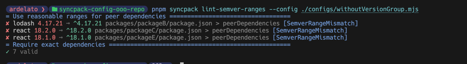
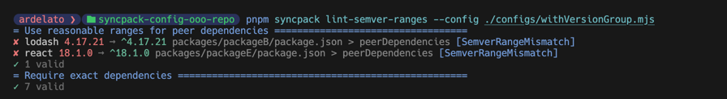
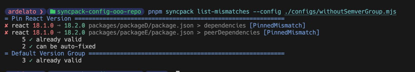
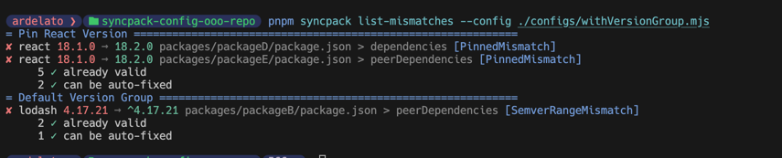

### Description

This is a repository to illustrate a potential bug in `syncpack` when using the `lint-semver-ranges` command with a
configuration file that includes a matching dependency policies in the `versionGroup`.

Vice-versa, the `list-mismatches` command also seems to be affected by the `semverGroup` policies.

The layout of the repository is as follows:
- A `pnpm-workspace.yaml` to define the workspace
- A `packages` directory with a minimalistic set of dependencies for each package
  - `packageA` is the base example with `react` declared in `dependencies`

  - `packageB` includes an additional `lodash` dependency in `devDependencies` and `peerDependencies`
    - This should trigger the `peerDependency` range policy

  - `packageC` declares `react` in `dependencies` and `peerDependencies`
    - This should also trigger the `peerDependency` range policy

  - `packageD` uses an older version of `react` in `dependencies`
    - This should trigger a mismatched version policy

  - `packageE` has both `react` in `dependencies` and `peerDependencies` and uses an older version of `react` in `peerDependencies`
    - I am assuming this should trigger both the `peerDependency` and mismatched version policies

- A `configs` directory with two configuration files for `syncpack`:
  - `withVersionGroup.mjs` includes a `versionGroup` and a `semverGroup`
  - `withoutVersionGroup.mjs` does not include a `versionGroup` but includes a `semverGroup`
  - `withoutSemverGroup.mjs` does not include a `semverGroup` but includes a `versionGroup`

### `lint-semver-ranges` Command

#### Expected Behavior

I would have expected the `lint-semver-ranges` command to only take into account the
`semverGroup` policies since the policy labels from that group are the only ones
logged in the output.

As such, I would have expected that all `peerDependencies` not using the `^` range to be flagged as errors.

#### Actual Behavior

However, because there is a `pinVersion` policy for `react` in the `versionGroup`, the `lint-semver-ranges` command marks the `react` `peerDependency` in `packageC` as valid since it uses the exact pinned version.

> [!NOTE]
> Notice that the `react: 18.1.0` `peerDependency` in `packageE` was still flagged as an error since it didn't match the pinVersion from the `versionGroup` policy.

> [!NOTE]
> Additionally the `lodash` `peerDependency` in `packageB` was also flagged as an error since there was no matching policy for it in the `versionGroup`.

### `list-mismatches` Command

#### Expected Behavior

I would have expected the `list-mismatches` command to only take into account the `versionGroup` policies since the policy labels from that group are the only ones logged in the output.

Since there is no range definition for all peer dependencies in the `versionGroup`, I expected the `lodash` `peerDependency` in `packageB` to not be flagged as an error.

#### Actual Behavior

> [!NOTE]
> The `withVersionGroup.mjs` configuration file has both a `versionGroup` and a `semverGroup`.

However, when running the `list-mismatches` with the `withVersionGroup.mjs` configuration file, the `lodash` `peerDependency` in `packageB` was flagged as an error.

I would not have expected this behavior since there is no range definition for `peerDependencies` in the `versionGroup`. If `list-mismatches` is supposed to take into account both `versionGroup` and `semverGroup` policies, then the `semverGroup` policies should be logged in the output as well instead of just under the `Default Version Group` label.
